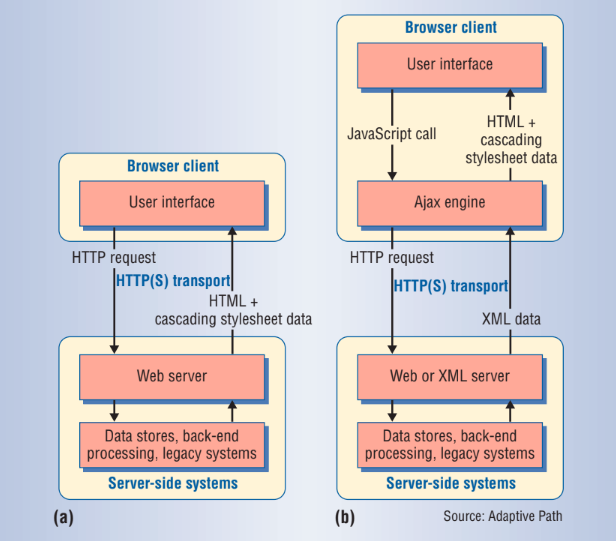

```
2.1 Uma breve história do desenvolvimento web [OK]
    - Surgimento da web
    - Aplicações estáticas (HTTP, HTML, CSS)
    - Surgimento do JavaScript
    - AJAX
    - Jquery e primeiros frameworks

2.2 Single Page Applications
    - Modelo
    - Atualmente: react, angular, vue, svelte

2.3 Document Object Model (DOM)

2.3 React.js
    - Princípios
    - Funcionalidades
    - Ecossistema

2.4 Virtual DOM

2.5 WebAssembly
    - História (JavaScript e asm.js)
    - Características técnicas
    - Linguagens
    - Casos de uso
    - Aplicação em Virtual DOMs (bibliotecas existentes)
```

### 2.1 Uma breve história do desenvovimento web
A World Wide Web foi criada em 1989 por Tim Berners-Lee [1], na época um
cientista da computação na CERN, com o objetivo de agregar e compartilhar
informações antes que fossem perdidas [2][3]. A proposta era criar uma "teia" de
documentos relacionados por ligações (hiperlinks) e que pudessem ser
visualizados por navegadores (browsers) [1]. Tecnologias emergentes, como redes
de computadores e seus protocolos de comunicação, e o já existente conceito de
"hipertexto", foram unidas para construir a teia descentralizada de sistemas de
informação que contava com participações de universidades e institutos de
pesquisa espalhados pelo mundo [1]. Nessa época foram fundadas as tecnologias
que permanecem como as bases das aplicações de hoje em dia: o protocolo HTTP
(HyperText Transfer Protocol), que permitiu a recuperação de recursos de
hipertexto conectados por links; o HTML (HyperText Markup Language), a linguagem
de formatação dos documentos de hipertexto; e os URI (Uniform Resource
Identifier), endereços que identificam unicamente cada recurso na web [2][6].

A Web funciona a partir da comunicação entre um servidor e um cliente feita
através do protocolo HTTP [5]. Normalmente, o cliente é um navegador: um
software que implementa o protocolo HTTP, capaz de se comunicar com servidores,
requisitando e exibindo páginas da web ao usuário. O servidor é responsável por
responder requisições de clientes e servir essas páginas [5]. No início, páginas
web normalmente eram simples e estáticas, formadas apenas por documentos HTML, o
componente mais básico da web, apesar de não ser considerada uma linguagem de
programação [6]. Com o uso de HTML era possível formatar textos, inserir imagens
e criar links para outras páginas. Quando clicado, um link faz o navegador
abandonar a página atual e carregar a página destino. Também havia o CSS, um
padrão W3C desde 1996 que permitia a customização da aparência da página [3]
quando utilizado em conjunto com o HTML.

Com o passar dos tempos e com a evolução dos navegadores, páginas web passaram a
se tornar cada vez mais complexas, principalmente após a criação do JavaScript
por Brendan Eich em 1995 [6]. Basicamente, um código JavaScript atrelado um
documento HTML permitia que a página tivesse seu conteúdo modificado sem a
necessidade de uma requisição ao servidor ou carregamento de uma nova página
[6]. Esse era o nascimento das técnicas de DHTML (Dynamic HTML), que na prática
se tratava de manipular, por meio do JavaScript, uma estrutura de dados
gerenciada pelo navegador chamada de Document Object Model (DOM) [9].
De acordo com a World Wide Web Consortium [10], é uma interface que permite o
acesso e atualização de conteúdo, estrutura e estilos de documentos HTML, e
garante que as alterações realizadas sejam incorporadas de volta à página.

Dessa forma, a validação de um formulário poderia ser realizada pelo próprio 
navegador (lógica client-side) ao invés de delegada ao servidor (lógica
server-side). Caso um campo obrigatório fosse esquecido, uma aviso poderia
ser mostrado na página prevenindo o envio de uma requisição com dados
incompletos [6]. A conexão lenta da época motivava estratégias que
diminuíssem a frequência da comunicação entre cliente e servidor e a
quantidade de dados trafegados na rede. Tais práticas melhoravam a experiência
do usuário das aplicações web, mas ainda eram limitadas em desempenho
e interatividade quando comparadas à aplicações nativas, que ofereciam uma
amplitude de interações e responsividade aos usuários [7][8].

A demanda por melhorias na Web levou ao surgimento de um novo padrão
de desenvolvimento de aplicações: o AJAX (Asynchronous JavaScript
and XML) [8], caracterizada por trazer mais processamento e lógica de negócio
para o cliente conferindo melhor desempenho e responsividade. A técnica
não se tratava de uma nova tecnologia, mas sim uma junção inovadora de
várias tecnologias já existentes no mercado [7][8]:

* Formatação, estilização de conteúdo e interatividade: HTML, CSS e JavaScript;
* Atualização dinâmica e interação com o conteúdo: Document Object Model (DOM);
* Representação de dados para transferência entre cliente e servidor: XML;
* Requisições HTTP para transferência assíncrona de dados: XMLHttpRequest;

Aplicações desenvolvidas com o padrão AJAX eram capazes de criar ou recuperar
dados realizando requisições ao servidor sem provocar um recarregamento da
página, o que trazia uma experiência bem mais fluida na web. Aplicações como o
Gmail e Google Maps foram pioneiras na utilização de AJAX
[7] e o padrão rapidamente se tornou uma tendência em aplicações de grandes
empresas (Google, Flickr, Amazon e várias outras [8]). Finalmente a web
ganhava dinâmicas comparáveis a aplicações desktop, com maior responsividade e
interatividade, e se tornava uma plataforma digna de aplicações de grande porte.

A figura mostra as diferenças de funcionamento de uma aplicação tradicional e
outra baseada em AJAX:



Em (A), uma aplicação web tradicional, requisições HTTP são enviadas a cada
interação do usuário. O servidor devolve uma nova página HTML ao cliente, que a
recebe e carrega o conteúdo seu conteúdo na tela [7]. A aplicação permanece
inutilizável caso a nova página seja grande ou a conexão esteja lenta, piorando
a experiência de uso. Numa aplicação AJAX (B), na qual todas as operações são
gerenciadas por JavaScript no navegador (client-side), o usuário não precisa esperar por
recarregamentos a cada interação. A aplicação manipula a própria interface enquanto lida com
interações, e caso necessite de comunicação com o servidor, o faz em segundo
plano, de forma assíncrona, permanecendo disponível para mais interações [7][8].

Essa nova maneira de projetar e construir aplicações web expôs tornou mais comum o uso
extensivo de diversas tecnologias e APIs cujas implementações não eram
compatíveis entre navegadores ou simplesmente não eram suportadas [7][11].
Para diminuir o esforço adicional de garantir uma mínima
compatibilidade entre os navegadores e melhorar a manutenabilidade do código,
surgem os frameworks JavaScript: bibliotecas de código aberto capazes de abstrair os diferentes
comportamentos dos navegadores, expondo funções utilitárias e criando padrões de
projeto para acelerar o desenvolvimento de aplicações [11]. Um das bibliotecas
mais utilizadas foi o jQuery [13], que tendo como lema *write less, do more*
(escreva menos, faça mais), oferecia uma série de utilitários de suporte a
manipulação do DOM, animações, AJAX e outros [12], além de abstrair o suporte
dos navegadores a essas funcionalidades.

Com o passar dos anos e a crescente maturação da plataforma web, o uso de AJAX
foi sendo aperfeiçoado e pouco a pouco novos frameworks JavaScript eram criados para
diminuir a complexidade de aplicações construídas com jQuery e outras
bibliotecas [13][14]. Surgiam ferramentas como o Backbone.js, Knockout.js e
Angular.js [14] com estratégias de mover cada vez mais lógica de negócio e
dados para o cliente de forma a diminuir o processamento no servidor [13], além
de abstrair ainda mais a manipulação do DOM. Era o nascimento das
*single-page applications* (SPA) [14][15], aplicações executadas em sua totalidade no
lado do cliente e não requerem nenhum recarregamento, minimizando ainda mais o tempo de
resposta para qualquer interação [16].

Atualmente, a utilização do padrão SPA está altamente difundida e as aplicações
web se tornam cada vez maiores e mais complexas, fazendo um uso extensivo de
JavaScript para gerenciar a grande quantidade de dados e regras de
negócio [16]. Na próxima seção, será detalhado o funcionamento de single page
applications e as principais ferramentas.

### 2.2 Single Page Applications
Como visto anteriormente, o desenvolvimento de aplicações web tem priorizado
cada vez mais práticas que trazem o processamento e renderização ao lado do
cliente (client-side) oposto ao antigo modelo rudimentar de processamento
realizado somente ao lado do servidor (server-side). Esse conjunto de novas compreensões foi
consolidado no que é chamado de single page application (SPA) [20]. Desde então,
surgiu uma nova geração de ferramentas para suportar o desenvolvimento dessas
aplicações, sendo o Angular, o React.js e o Vue.js as principais [17].

De acordo com Mikito Takada [21], uma SPA possui uma experiência de usuário mais
próxima de uma aplicação nativa (desktop) devido a sua capacidade de atualizar qualquer parte da
interface de usuário sem a necessidade de comunicar-se com um servidor. Esse
tipo de aplicação contém toda a lógica de negócio necessária para gerenciar seus
dados e sua interface de usuário localmente, dessa forma menos comunicações com
o servidor são necessárias para reagir a interações [16]. Atualmente, as principais redes sociais como
Facebook, Twitter e Instagram são SPAs [20].

Uma das primeiras ferramentas que pavimentaram o caminho para a adoção de SPAs
foi o AngularJS, lançado em 2010, sendo um projeto suportado pela Google [18].
Esse framework foi um dos primeiros a introduzir o conceito de
data-binding bidirecional [14], que permitia relacionar variáveis JavaScript a
elementos HTML resultando em atualizações de página automáticas a cada mudança de valor
da variável [14]. Tal abstração da manipulação do DOM permitiu que os
desenvolvedores focassem mais nas funcionalidades da aplicação do que nos
desafios técnicos de sua implementação. Para detectar mudanças em dados e
refleti-las no HTML, o AngularJS utilizava a técnica dirty checking [16], na
qual são realizadas comparações periódicas nos dados da aplicação à procura de
mudanças. Um dado é classificado como "sujo" caso uma modificação em seu valor
tenha sido detectada, assim as partes da interface que dependem de seu valor
podem ser notificadas e atualizadas [16][22]. Um ciclo de dirty checking é
custoso, pois faz necessário percorrer todos os dados observáveis da aplicação e
compará-los a seus valores anteriores, logo uma série de otimizações são
realizadas pelo AngularJS para que o algoritmo de checagem seja eficiente [16]. 

Em 2013 foi apresentado o React.js [14], uma ferramenta desenvolvida por
engenheiros do Facebook para resolver um problema interno: manter a interface de
usuário sincronizada com a lógica de negócio e os dados de aplicações em larga
escala [23]. Um dos principais diferenciais do React.js é a abstração da
manipulação do DOM por meio de uma estrutura de dados conhecida
como Virtual DOM, com a qual seu algoritmo pode detectar mudanças na interface e
aplicá-las em lote no DOM real, minimizando o impacto no desempenho
[14][23]. A técnica do virtual DOM se diferencia do dirty checking do AngularJS
pois não é necessário monitorar o modelo de dados procurando por mudanças [14].
Devido a isso, no React.js é preferível o modelo de
**data-binding unidirecional**, no qual mudanças nos dados provocam atualizações
na interface [16] (ao contrário do AngularJS, que utiliza a abordagem
bidirecional). Outro benefício oferecido pelo React.js é a possibilidade de compor a interface do
usuário em componentes indepedentes e reutilizáveis [16]. 

O Vue.js, criado em 2014, é outro framework JavaScript que decidiu implementar um virtual DOM e
sua utilização tem crescido nos últimos anos [14][18]. É uma ferramenta focada
na facilidade de uso, visto que pode ser adicionado a uma aplicação simplesmente
inserindo uma tag `script` no HTML [14]. Além disso, sua curva de aprendizado é
considerada menor que a curva do Angular, React e outros frameworks [25].

[inserir conexão]


### 2.4 React.js

O React.js é uma das principais bibliotecas de JavaScript, de código aberto, para construção de
interfaces de usuário na web, sendo o framework de front-end mais amado de acordo
com o Stack Overflow Developer Survey 2019 [26]. Foi desenvolvido pelo Facebook
com o objetivo de suportar aplicações de larga escala, com grandes
quantidades de dados e regras de negócio [23]. Hoje, o React.js é utilizado por
diversas companhias como Uber, Netflix, Reddit e Paypal [18].

Um dos grandes diferenciais do React.js é a utilização de um estilo
declarativo de programação [16], com o qual basta especificar como a interface
deve ser, então o React se encarregará de atualizar e renderizar os elementos de
acordo com o que foi declarado pelo desenvolvedor. De acordo com sua
documentação oficial, "interface declarativas tornam o código mais previsível e
mais fácil de depurar" [27].

Uma aplicação React é composta por vários componentes. Um
componente é uma parte integrante da interface de usuário que deve ser
independente das demais e também reutilizável, permitindo que o desenvolvedor da
aplicação possa pensar em cada parte isoladamente [28]. O código abaixo é um
exemplo de componente React, que renderiza um elemento `div` contendo o texto `"Hello
Taylor"`:

```js  
function HelloMessage(props) {
  return <div className="hello">Hello, {props.name}!</div>;
}

const root = document.getElementById('root');
ReactDOM.render(<HelloMessage name="Taylor" />, root);
```
No trecho de código acima utiliza-se o JSX [30], uma sintaxe semelhante ao HTML
que facilita a construção de layouts. Como o JSX não é código JavaScript válido,
é necessário utilizar a ferramenta Babel para convertê-lo em chamadas à função
`React.createElement` que o navegador consegue interpretar:

```js
function HelloMessage(props) {
  return React.createElement("div", { className: "hello"}, `Hello, ${props.name}!` );
}
```

O mesmo componente pode também ser declarado como uma classe JavaScript:

```js
class HelloMessage extends React.Component {
  render() {
    return <div className="hello">Hello, {this.props.name}!</div>;
  }
}

const root = document.getElementById('root');
ReactDOM.render(<HelloMessage name="Taylor" />, root);
```

Componentes também podem instanciar outros componentes em seu corpo [28]. Dessa
forma, o layout de uma página pode ser composto por uma árvore de componentes:

```js
function App(){
  return (
    <HelloMessage name="Alice" />
    <HelloMessage name="Bob" />
    <HelloMessage name="Carol" />
  )
}

const root = document.getElementById('root');
ReactDOM.render(<App />, root);
```

Utilizando classes, um componente pode criar e gerenciar seu estado. No React,
estado é um conjunto de dados dinâmicos controlados pelo componente e
persistidos entre várias renderizações. Quando o estado de um componente muda,
ele é renderizado novamente e as mudanças são refletidas no DOM. Um componente
pode atualizar seu estado utilizando o método `setState`, mas com a adição
dos React Hooks, a partir da versão 16.8 [29], componentes funcionais podem criar e
atualizar estado usando o hook `useState`.

```js
function ClickCount() {
  const [count, setCount] = useState(0);

  return (
    <div>
      <p>Você clicou {count} vezes</p>
      <button onClick={() => setCount(count + 1)}>Clique-me</button>
    </div>
  );
}
```

Na próxima seção, será aprofundado o funcionamento do Document Object Model
(DOM) para que o mecanismo do Virtual DOM no React.js possa ser detalhado mais facilmente.

### 2.3 Document Object Model (DOM)
Como discutido anteriormente, o Document Object Model (DOM) é um padrão
implementado nos navegadores que permite o acesso e atualização do
conteúdo e aparência de e uma página web por meio de JavaScript, sendo uma peça chave para a
interatividade na web [10][18]. Parte central desse componente é uma representação em memória da
página HTML composta por objetos manipuláveis por meio de métodos providos pela
API [14]. O DOM pode ser compreendido como um agrupamento hierárquico de
objetos ou uma árvore, na qual cada nó representa um elemento HTML e possui
atributos que correspondem a atributos HTML [14] e uma API contendo métodos que permitem sua
manipulação [18]. Essa árvore é gerada internamente pelo navegador ao realizar a
leitura de um documento HTML e representa a estrutura ou estado de uma página [18].
A figura abaixo descreve como um documento HTML pode ser mapeado para um DOM:

(código HTML x árvore DOM equivalente)

Antes que um navegador possa renderizar uma página na tela, é necessário
processar o documento HTML obtido através da web. É criado um objeto `Node` para cada
elemento [18, 31] após a transformação dos caracteres do arquivo HTML em tokens [31].
Por fim, as relações de parentesco entre os elementos são criadas, e o resultado
é uma estrutura de dados em árvore do DOM, a qual o navegador
utiliza como modelo para o processo de renderização [31]. A árvore então fica
disponível para ser acessada por um código JavaScript a partir da variável
`window.document`. Com isso, é possível utilizar uma série de métodos da DOM API
para atualizar a árvore do DOM e seus elementos [32], como `Document.createElement` para
instanciar novos elementos e `Node.appendChild` para inserir elementos na
página.

Após a primeira renderização, atualizações ao conteúdo da página realizadas pela
aplicação irão disparar rotinas de renderização do navegador conhecidas como
*reflow* e *repaint* [18]. O reflow faz o recálculo
das posições e tamanhos de todos os elementos da página, e o repaint "pinta"
os pixels da tela conforme as demarcações de cada elemento [33]. 
Ambas as rotinas são custosas e podem provocar travamentos na aplicação caso
sejam disparadas repetidamente, piorando a experiência de uso. Devido a isso, a
utilização direta da DOM API numa aplicação para atualizar a interface
de usuário deve ser feita com cautela para minimizar reflows e repaints. [14].


### 2.5 Virtual DOM

Um virtual DOM é uma representação do DOM composta por objetos
JavaScript, que é gerada a cada interação. Mudanças na interface podem ser
detectadas com o algoritmo de **reconciliação** [24], que compara um novo virtual DOM
a outro pré-existente [18]. O resultado é o conjunto mínimo de mudanças a serem realizadas
no DOM para sincronizá-lo ao virtual DOM mais recente [16].

```
[1] https://home.cern/science/computing/birth-web/short-history-web
[2] https://webfoundation.org/about/vision/history-of-the-web/
[3] http://info.cern.ch/Proposal.html
[4] https://timeline.web.cern.ch/cern-puts-world-wide-web-public-domain
[5] Building user interfaces with virtual DOM a comparison
[6] Miller D. The power of JavaScript
[7] Building Rich Web Apps with Ajax (linda dailey paulson)
[8] Ajax: A new approach to web applications (Jesse James Garrett)
[9] DHTML Utopia
[10] W3C: DOM https://dom.spec.whatwg.org/#what
[11] MooTools essentials
[12] jquery https://jquery.com/
[13] The Performance Analysis of Web Apps based on virtual dom and reactive user
interfaces
[14] How does the virtual DOM compares
[15] Comparison of Single-Page Application Frameworks
[16] Building user interfaces using virtual DOM A comparison 
[17] State of JS 2019: Frameworks https://2019.stateofjs.com/front-end-frameworks/
[18] JavaScript DOM manipulation performance Comparing...
[19] Single Page Web Apps Manning Book
[20] Speed index and critical path
[21] Mikito Takada. Single page apps in depth.
http://singlepageappbook.com/goal.html, 2016. Accessed: 2016-04-05.
[22] https://docs.angularjs.org/guide/scope#scope-life-cycle
[23] React: Facebook's Functional Turn on Writing JavaScript
[24] https://reactjs.org/docs/reconciliation.html
[25] https://br.vuejs.org/v2/guide/comparison.html.
[26] https://insights.stackoverflow.com/survey/2019#technology-_-most-loved-dreaded-and-wanted-web-frameworks
[27] https://reactjs.org/
[28] https://reactjs.org/docs/components-and-props.html
[29] https://pt-br.reactjs.org/blog/2019/02/06/react-v16.8.0.html
[30] https://pt-br.reactjs.org/docs/introducing-jsx.html
[31] https://developers.google.com/web/fundamentals/performance/critical-rendering-path/constructing-the-object-model
[32] https://developer.mozilla.org/pt-BR/docs/Web/API/Document
[33] https://developers.google.com/speed/docs/insights/browser-reflow
```