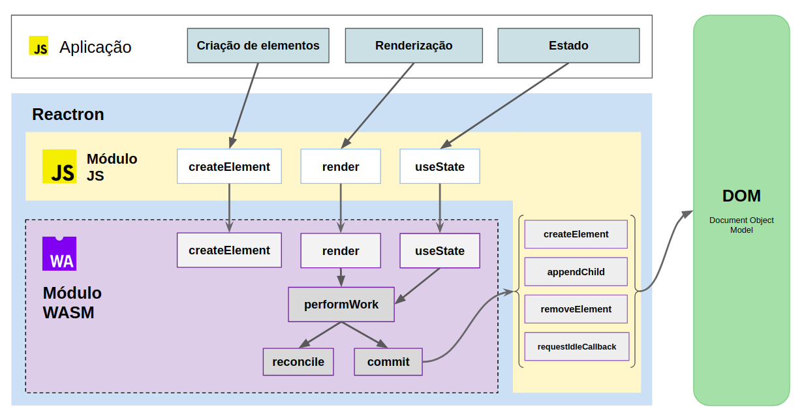

```
3. Desenvolvimento da biblioteca
  3.1 Objetivos
    3.1.1 Suporte a API do React (render e hooks)
    3.1.2 Uso de um módulo WebAssembly no diffing
  3.2 Ferramentas utilizadas
    3.2.1 Rust
    3.2.2 Wasmpack
    3.2.3 Webpack
  3.3 Resultado do desenvolvimento
    3.3.1 Diagrama da solução
    3.3.2 Caso de uso: aplicação TodoMVC
```

### 3. Desenvolvimento

A biblioteca React.js é, atualmente, uma das mais utilizadas para o desenvolvimento de aplicações front-end, tendo mais de 8 milhões de downloads semanais no NPM [1]. Com um grande número de projetos utilizando-o como dependência, a expectativa é que o React seja uma ferramenta estável à longo prazo, capaz de se manter atualizada com novos padrões e tecnologias, e, ao mesmo tempo, sem "breaking changes" (mudanças na interface pública da biblioteca), o que facilitará o processo de upgrade de versão em aplicações legadas.

Tendo a tecnologia WebAssembly se mostrado vantajosa em questões de desempenho em vários casos de uso [2], imagina-se que futuramente sua possível integração na base de código do React ou de outras bibliotecas e frameworks possa ser benéfica, e ainda mais caso seu uso possa oferecer vantagens sem a necessidade de breaking changes. Atualmente a utilização de Wasm no React.js ainda não está em discussão, apesar de cogitada [3], visto que a tecnologia ainda encontra-se em seus primeiros passos.

Assim, com base em todo o contexto técnico detalhado nos capítulos anteriores, este trabalho propõe a implementação de uma biblioteca de desenvolvimento de interfaces de usuário (front-end) na linguagem JavaScript, baseada no React.js, que seja capaz de delegar as operações complexas de seu virtual DOM para um módulo WASM. Essa biblioteca pode ser considerada um protótipo de uma possível futura versão do React, que em vez de implementar os mecanismos de reconciliação em JavaScript, uma linguagem dinâmica executada numa máquina virtual, o faz via WebAssembly, cujas instruções binárias podem ser capazes de atingir desempenho próximo ao nativo [4].

Com o término desse desenvolvimento será possível realizar uma comparação de desempenho e consumo de memória entre duas aplicações (uma delas desenvolvida a partir do protótipo desse trabalho, e a outra a partir do React.js), e com isso investigar se o uso de WebAssembly seria realmente vantajoso para o React e quais as características ou limitações são responsáveis pela conclusão.

É importante ressaltar que o React não possui, pelo menos publicamente, uma especificação técnica de implementação. Logo, a construção do protótipo foi realizada com base na análise do código-fonte do React.js (a partir de seu repositório no Github [6]) e em sua documentação oficial [7], onde se explica em alto nível como ocorre o processo de reconciliação. Além disso, outros materiais de referência técnica foram de suma importância para a conclusão do protótipo, como os blogposts "Inside Fiber: in depth overview of the new reconciliation algorithm in React", de Max Koretskyi [8] e "Build Your Own React", de Rodrigo Pombo [9], que exploram mais a fundo o funcionamento interno do React.

Devido ao tempo limitado para o desenvolvimento do presente trabalho, o protótipo implementará apenas um subconjunto das funcionalidades que o React oferece atualmente. Porém, ainda será possível aplicar seus princípios de forma a tornar possível a existência de componentes cujos códigos possam ser compartilhados entre as duas bibliotecas com mudanças mínimas. Uma lista de funcionalidades do React que não fazem parte do escopo pode ser lida na seção (TODO: seção não-objetivos) Para fins de simplificação, o protótipo desenvolvido será referido como Reactron a partir da próxima seção.

### 3.1 Objetivos de alto nível
Usuários hipotéticos do Reactron que utilizem-no para desenvolver aplicações devem esperar que ele seja capaz de realizar três tarefas básicas: manipulação do DOM, componentização e criação de estado local, as quais serão descritas com mais detalhes nas subseções seguintes.

#### 3.1.2. Manipulação do DOM
O Reactron deve ser capaz de criar, atualizar e remover elementos no DOM automaticamente, de acordo com o que é definido pelo usuário. Elementos são blocos de construção do layout da aplicação. A principal maneira de declarar elementos, como um usuário da biblioteca, é utilizar o JSX [11], uma sintaxe semelhante ao HTML que facilita a construção de layouts. Toda aplicação desenvolvida com o React, e também o Reactron, deve gerar uma árvore de elementos que serão processados e renderizados, e isso se dará inserindo-os como filhos de um elemento pré-existente no DOM utilizando a função `render`:

```js
let element = <h1>Hello world!</h1>;

// Insere o elemento como filho da tag "body"
render(element, document.getElementByTagName("body"));
```

Ser capaz de criar, atualizar e remover elementos definidos pelo usuário é essencial para o objetivo final da biblioteca, que é sincronizar a interface de usuário com os dados da aplicação.

#### 3.1.2. Componentização
O Reactron deve permitir a composição de elementos em unidades conhecidas como componentes. De acordo com a documentação oficial do React, um componente é uma parte integrante da interface de usuário que deve ser independente das demais e também reutilizável, permitindo que o desenvolvedor da aplicação possa pensar em cada parte isoladamente [15]. Um componente é como uma função: ele recebe uma ou mais entradas e retorna uma descrição do que deve aparecer na tela [15]. As entradas do componente são conhecidas como "props" (propriedades) e torna possível customizar o seu comportamento. O retorno do componente, por sua vez, é uma árvore de elementos que representa a interface de usuário resultante em determinado momento e contexto.

Assim como no React, componentes Reactron devem ser declarados com simples funções do JavaScript, e com a sintaxe JSX, podem ser instanciados como tags HTML:

```js
function User(props) {
  return (
    <div className="user">
      
      <span>props.name</span>
    </div>
  );
}

render(
  <User name="Alice" avatarUrl="/users/alice.jpg" />,
  document.getElementByTagName("body")
);
```

Também é possível instanciar componentes dentro de outros componentes:

```js
function UserList(props) {
  return (
    <div className="user-list">
      <User name="Alice" avatarUrl="/users/alice.jpg" />
      <User name="Bob" avatarUrl="/users/bob.jpg" />
      <User name="Carol" avatarUrl="/users/carol.jpg" />
    </div>
  )
}

render(<UserList />, document.getElementByTagName("body"));
```

Compor diversos componentes é a principal estratégia no React para construir interfaces robustas, e esse mesmo padrão deve ser utilizado também no Reactron. No React há duas formas de declarar componentes: utilizando funções, como discutido acima, e também utilizando classes [16], porém o Reactron só deve suportar a declaração de componentes funcionais devido a sua maior simplicidade de implementação. Além disso, componentes funcionais são uma maneira mais elegante de escrever componentes React desde sua versão 16.8, com a introdução dos Hooks [12].

No Reactron, normalmente o layout da aplicação é uma árvore de elementos gerada por um componente, que por sua vez pode conter diversos componentes em seu corpo. Dessa forma, componentização também é essencial para alcançar o objetivo final da biblioteca.

#### 3.1.3. Gerenciamento de estado local
No React, um componente pode conter estado, isto é, um conjunto de dados dinâmicos controlados pelo componente e persistidos entre várias renderizações. O estado normalmente é um objeto JavaScript que guarda todos os dados que o componente precisa, e ele pode ser modificado com o uso do método `setState`. Para criar estado em componentes funcionais é preciso usar o hook `useState` [12], uma função que retorna o estado inicial e também uma função que atualiza o valor do estado. Nesse caso, o estado não precisa necessariamente ser um objeto, já que `useState` pode ser utilizado várias vezes em um mesmo componente [12].

O Reactron deve oferecer o hook `useState` como a principal forma de criar estado local em componentes, concluindo a tríade das tarefas básicas de responsabilidade da biblioteca. Dessa forma, uma aplicação desenvolvida com o Reactron será capaz de construir seu layout e manipulá-lo para refletir seu estado.

### 3.2 Funcionalidades fora de escopo
O React oferece diversas outras funcionalidades além das discutidas anteriormente, mas elas não se encontrarão dentro do escopo do que será implementado no Reactron devido ao tempo restrito para o desenvolvimento do protótipo. As principais funcionalidades fora do escopo do Reactron são:

* Componentes via classes: componentes no React também podem ser declarados como classes ES6 [16]. No Reactron apenas componentes funcionais serão suportados;
* Ciclo de vida: classes no React permitem o uso de métodos importantes como `componentDidMount` e `shouldComponentUpdate`, que fazem parte do ciclo de vida de um componente [19]. Isso não será suportado pelo Reactron.
* Eventos sintéticos: o React oferece a classe `SyntheticEvent`, usado para igualar o comportamento de eventos nativos entre diferentes navegadores [20]. No Reactron, os componentes terão acesso aos objetos originais dos eventos.
* Atributo `key`: No React é uma boa prática utilizar o atributo `key` ao renderizar uma lista de elementos [21]. Esse atributo, quando seu valor é único para cada item, é importante para uma otimização durante a reconciliação, quando o React realiza checagens para descobrir quais itens sofreram mudanças. No caso do Reactron, essa otimização não será implementada, logo o uso do atributo `key` em listas de elementos não é estritamente necessária.
* Error boundaries: No React, error boundaries são componentes responsáveis por reagir a exceções em seus componentes filhos o logar os erros [23], prevenindo que a aplicação inteira permaneça em estado de erro. No Reactron, isso não será suportado.
* Refs: o React também permite que os componentes acessem referências a elementos do DOM [24]. No Reactron, isso não será suportado.
* Outros Hooks: Alguns hooks importantes para a manutenção do estado e do ciclo de vida, como o `useEffect` e o `useContext`, e outros menos comuns como `useCallback`, `useReducer` e `useMemo` [25], estarão fora do escopo do Reactron, visto que para o desenvolvimento de aplicações simples o `useState` é suficiente.
* Modo concorrente: Até o momento do desenvolvimento desse trabalho, o concurrent mode do React ainda está em fase experimental [26]. De qualquer forma, também não será implementado no Reactron.


### 3.3 Arquitetura e funcionamento interno

O Reactron será utilizada por usuários como uma biblioteca JavaScript comum, podendo ser instalada por meio do gerenciador de pacotes NPM [22], mas seu objetivo final é delegar as operações complexas do virtal DOM a um módulo WebAssembly. Logo, sua arquitetura interna foi elaborada de forma a tornar possível que dois agentes, o corpo de código JavaScript e o módulo WebAssembly, possam trabalhar em conjunto. Essa arquitetura pode ser resumida no seguinte diagrama, que será detalhado nas próximas seções



### 3.3.1 Módulo JS

O Reactron contará com uma camada de código JavaScript, que será chamada de Módulo JS, que funciona como intermediária às funções internas do módulo WebAssembly. Com essa camada intermediária, os usuários do Reactron não terão a necessidade de lidar diretamente com o WebAssembly - que passa a ser um mero detalhe de implementação - e simplesmente fazem o uso de funções JavaScript, mantendo a coesão entre os módulos. 

O módulo JS deverá expor funções que serão utilizadas diretamente pelos usuários da biblioteca em aplicações a serem desenvolvidas, mas também conterá uma série de funções de uso privado do módulo WASM (geradas automaticamente pela ferramenta `wasm-bindgen` [17], a ser detalhada na próxima seção), permitindo-o manipular o DOM (`createElement`, `appendChild`, `removeElement` e outras) e acessar outras APIs do navegador (como a função `requestIdleCallback`). A interface pública do módulo JS deverá conter as seguintes funções: `createElement`, `render`, `useState` e `load`, as quais serão detalhadas nas subseções seguintes. 

#### 3.3.1.1. `createElement`
`createElement` será responsável pela declaração de elementos que serão gerenciados pelo Reactron para a construção do layout da aplicação. Essa função não deve ser usada diretamente pelo usuário da biblioteca, pois um transpilador como o Babel [10] pode transformar a utilização da sintaxe JSX [11] para chamadas a `createElement`. O código JSX abaixo exemplifica a criação de um elemento:

```js
let element = <div className="greeting">Hello world!</div>;
```

Fazendo a transpilação do código acima (já que não se trata de código JavaScript válido) por meio do Babel, temos como resultado o seguinte código:

```js
let element = createElement("div", { className: "greeting" }, createElement("Hello world!"));
```

#### 3.3.1.2 `render`
`render`, como discutido anteriormente, renderiza os elementos na tela. Internamente, sua chamada informará ao virtual DOM a árvore de elementos que deverá ser renderizada e qual elemento já existente no DOM deverá conter essa árvore:

```js
let element = <div className="greeting">Hello world!</div>;
let container = document.getElementByTagName("body");

render(element, container);
```

A chamada a `render` terá o seguinte HTML como resultado:

```html
<html>
  <body>
    <div class="greeting">Hello world!</div>
  </body>
</html>
```

#### 3.3.1.3 `useState`
`useState` é um dos Hooks [12] introduzidos na versão 16.8 do React [5]. Hooks são funções utilitárias que permitem que componentes acessem funcionalidades importantes do React, como estado e ciclo de vida, o que até então era possível definindo componentes com classes JavaScript [12] (que se tornaram disponíveis com a especificação ECMA-262 a partir da versão ES6 [13][14]). O hook `useState` permite que um componente funcional possa conter e controlar dados dinâmicos que são persistidos a cada ciclo de renderização. O Reactron deve oferecer a função `useState` que terá o mesmo uso do React hook homônimo. Abaixo temos um exemplo de componente funcional que possui estado gerenciado pelo `useState`:

```js
function Example() {
  const [count, setCount] = useState(0);

  return (
    <div>
      <p>Você clicou {count} vezes</p>
      <button onClick={() => setCount(count + 1)}>
        Clique-me
      </button>
    </div>
  );
}
```

#### 3.3.1.4 `load`
Para invocar funções WebAssembly via JavaScript, é necessário carregar o módulo em memória para que seja realizada a compilação das instruções binárias, o que ocorre assincronamente [27]. Com essa restrição, houve a necessidade de adicionar a função `load` para encapsular a instanciação e importação do módulo WebAssembly. Com isso, é apenas necessário envolver a chamada a `render` em um callback que será executado logo após a importação ser concluída:

```js
load().then(() => {
  render(<App />, document.getElementById("root"));
});

```

### 3.3.2 Módulo WebAssembly
O núcleo do Reactron será um módulo WebAssembly, responsável por guardar o contexto interno e executar todas as operações do virtual DOM. O funcionamento do virtual DOM juntamente com as principais funções desse módulo podem ser descritos a partir dos seguintes passos:

#### 3.3.2.1. Criação de elementos (`createElement`)
Cada chamada à função `createElement` do módulo JavaScript, realizadas a partir do uso de JSX, resultará em outra chamada ao método homônimo no módulo WASM, que irá alocar um novo objeto `VolatileElement` (um elemento vólatil que servirá apenas de base para a criação do virtual DOM) e retornará um ponteiro (um número inteiro) para ele. Assim, os elementos não são objetos JavaScript, mas sim bytes localizados na memória linear do WebAssembly. O motivo de ponteiros serem necessários é puramente técnico: evitar o custo da serialização/deserialização de objetos na "ponte" entre os módulos JS e WASM.

Resumidamente, o retorno de um componente Reactron é um ponteiro ao objeto `VolatileElement`. Chamadas subsequentes ao componente irão retornar ponteiros diferentes (devido a alocação de objetos diferentes):

```js
function Example() {
  return <h1>Hello world</h1>;
}

console.log(<Example />); // => 1102354
console.log(<Example />); // => 1102972
```

Para desencadear o próximo passo é necessário invocar a função `render` passando como parâmetro o ponteiro do elemento a ser renderizado e o elemento no qual inserir a árvore de elementos resultante.

```js
let element = <Example />;
render(element, document.getElementById("root"));
```

#### 3.3.2.2. Processamento de elementos (`workLoop` e `performWork`)
A função `render` do módulo JS realiza uma chamada à função homônima do módulo WebAssembly, que recebe o ponteiro do elemento a ser renderizado e começa o processo de criação ou manutenção do virtual DOM propriamente dito. No contexto do Reactron, o virtual DOM é uma árvore de objetos `Fiber` que perduram durante todo o ciclo de vida de uma aplicação. Cada `Fiber` representa um elemento do DOM. Na primeira chamada a `render`, para cada `VolatileElement` um novo `Fiber` é criado do zero e é anexado à árvore do virtual DOM.

#### 3.3.2.3. Reconciliação (`reconcile`)
Quando há mudanças de estado, a partir da utilização de `useState`, todos os componentes da aplicação são reinstanciados, produzindo uma nova árvore de objetos `VolatileElement`. Com isso, o processo de reconciliação inicia: os objetos `Fiber` da árvore do virtual DOM existente são utilizados para verificar se os novos `VolatileElement` resultantes dos componentes representam alguma mudança que possa alterar o layout da aplicação, como adições e deleções de elementos filhos ou atualizações de propriedades. Assim, todas as propriedades e elementos filhos são comparados. Quando uma mudança é detectada em um `Fiber`, ele é adicionado a uma lista de mudanças (também chamada de lista de efeitos). Após todos os fibers serem comparados com os objetos voláteis, a reconciliação termina.

#### 3.3.2.4. Aplicação de mudanças no DOM (`performWork` e `commit`)
A lista de mudanças resultante da reconciliação é uma descrição de todas as alterações que devem ser feitas no DOM real. Neste último passo, a função `performWork` do módulo WebAssembly itera sobre os fibers marcados com mudanças e invoca a função `commit` para cada um. `commit` irá utilizar as funções utilitárias do módulo JS para realizar cada mudança no DOM. Após esse processo, o DOM real e o virtual DOM estarão sincronizados e o controle de execução retorna à aplicação.

### 3.4 Ferramentas de desevolvimento

#### 3.4.1. Rust
O módulo WASM integrante do protótipo foi desenvolvido na linguagem Rust [28] devido ao seu foco em performance e confiabilidade, além do seu amplo e avançado suporte ao desenvolvimento de WebAssembly [29]. Foram utilizadas várias ferramentas de seu ecossistema, como as bibliotecas `wasm-bindgen` [30] (geração automática de código intermediário entre JS e WASM), `web_sys` e `js_sys` (APIs Web e JavaScript via WebAssembly), e o utilitário de linha de comando `wasm-pack` [31] (simplificação do processo de desenvolvimento WebAssembly com Rust).

#### 3.4.2. Webpack, Babel 
A ferramenta Webpack

```
[1] https://www.npmjs.com/package/react
[2] ?
[3] https://github.com/facebook/react/issues/7942#issuecomment-254984862
[4] 6. WebAssembly. High-Level Goals. Disponível em: https://webassembly.org/docs/
high-level-goals/. Acesso em: 15 de setembro de 2020.
[5] https://pt-br.reactjs.org/blog/2019/02/06/react-v16.8.0.html
[6] https://github.com/facebook/react/
[7] https://reactjs.org/docs/reconciliation.html
[8] https://indepth.dev/inside-fiber-in-depth-overview-of-the-new-reconciliation-algorithm-in-react/
[9] https://pomb.us/build-your-own-react/
[10] https://babeljs.io/
[11] https://pt-br.reactjs.org/docs/introducing-jsx.html
[12] https://pt-br.reactjs.org/docs/hooks-intro.html
[13] https://tc39.es/ecma262/#sec-class-definitions
[14] https://developer.mozilla.org/en-US/docs/Web/JavaScript/Reference/Classes
[15] https://reactjs.org/docs/components-and-props.html
[16] https://reactjs.org/docs/components-and-props.html#function-and-class-components
[17] https://github.com/rustwasm/wasm-bindgen
[18] https://developer.mozilla.org/pt-BR/docs/Glossario/Polyfill
[19] https://reactjs.org/docs/state-and-lifecycle.html
[20] https://reactjs.org/docs/events.html
[21] https://reactjs.org/docs/lists-and-keys.html#keys
[22] https://www.npmjs.com/
[23] https://reactjs.org/docs/error-boundaries.html
[24] https://reactjs.org/docs/forwarding-refs.html
[25] https://reactjs.org/docs/hooks-reference.html
[26] https://reactjs.org/docs/concurrent-mode-intro.html
[27] https://developer.cdn.mozilla.net/en-US/docs/WebAssembly/Loading_and_running
[28] https://www.rust-lang.org/pt-BR
[29] https://www.rust-lang.org/pt-BR/what/wasm
[30] https://github.com/rustwasm/wasm-bindgen
[31] https://github.com/rustwasm/wasm-pack
```