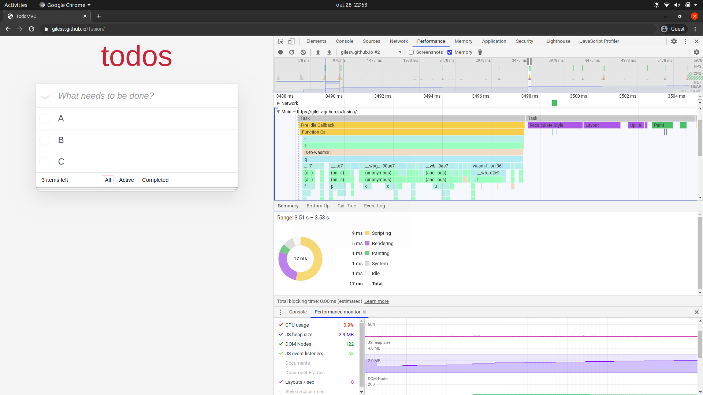

```
4. Metodologia
  4.1 GQM
    - Objetivos, questões e métricas
  4.2 Proposta de desenvolvimento
  4.3 Coleta de dados
    4.3.1 Chrome DevTools performance timeline
      - Tempo de carregamento (First Paint e First Contentful Paint)
      - Tempo de renderização e execução
      - Consumo de memória
      - Tamanho
    4.3.2 Puppeteer
    4.3.3 Casos de teste
```

## Metodologia
O presente estudo foi conduzido com base na metodologia GQM [1], que busca
estabelecer metas e elaborar questões e métricas associadas.

### GQM

A meta elaborada foi a seguinte:
*Analisar a aplicabilidade da tecnologia WebAssembly na implementação de
Virtual DOMs a fim de melhorar eficiência de aplicações web do ponto de vista
do usuário.*

As questões elaboradas e suas métricas:

**Q1**: É possível ter um bom nível de desempenho no Virtual DOM implementado em
WebAssembly frente ao React em aplicações web?
- **M1**: Tamanho da aplicação
- **M2**: Tempo de carregamento
- **M3**: Tempo de renderização e execução
- **M4**: Consumo de memória

**Q2**: Quais características da tecnologia WebAssembly impactaram
positivamente ou negativamente na eficiência de seu virtual DOM?
- **M4**: ?
- **M5**: ?


### Coleta de dados

#### Desenvolvimento do Reactron
Para que seja possível responder às questões elaboradas no GQM e cumprir sua
meta, esse trabalho propõe o desenvolvimento de um protótipo experimental de uma
biblioteca para desenvolvimento de aplicações web, baseada no React, que faça o uso de um
Virtual DOM implementado com a tecnologia WebAssembly. O protótipo desenvolvido
nesse trabalho é referido como Reactron. Dessa forma, será
possível realizar testes de benchmarking para a coleta de dados a respeito do desempenho com base em uma
aplicação de teste para validar a maturidade da tecnologia WebAssembly na
construção de aplicações web mais eficientes e sua possível inclusão em futuras
versões do React.

Para realizar a coleta de dados de desempenho foi necessário elaborar uma
aplicação de teste que pudesse exemplificar cenários de manipulação do DOM
(criação, atualização e remoção de elementos). A aplicação desenvolvida foi a
TodoMVC [2], um projeto de código-aberto bastante conhecido na comunidade que é
reimplementado em cada framework existente com o objetivo de realizar
comparações entre as diferentes tecnologias e também servir como recurso de
aprendizado. TodoMVC é basicamente uma lista de afazeres, sendo
composta por um campo de texto, uma lista de itens e botões de filtragem. É
possível criar, editar, marcar itens como concluídos ou removê-los.

Para o propósito de comparação, duas versões da aplicação TodoMVC foram desenvolvidas.
A primeira versão utiliza o React (bundle de produção, versão 16.13.1) como
dependência, e a outra utilizando o Reactron, a biblioteca proposta nesse
trabalho. Ambas as versões compartilham as mesmas funcionalidades e até mesmo
grande parte do código fonte.

#### Medição de desempenho
Para realizar a coleta de dados nas aplicações de teste foi utilizada a ferramenta Puppeteer para
executar interações na aplicação de forma automatizada e o Chrome DevTools para
monitorar métricas de desempenho da aplicação durante as interações e gerar relatórios.

O Puppeteer é uma biblioteca Node.js que oferece uma API de alto nível para
controle programático de uma instância do navegador Chrome de forma *headless* (executado sem a
interface de usuário), normalmente utilizado para executar testes de interface automáticos em
ambientes de integração contínua [6]. Um script que utiliza o Puppeteer é capaz
de abrir uma página da web, simular ações de um usuário (clicar em botões,
preencher formulários, etc.), inspecionar o DOM e também acessar e controlar funcionalidades
do Chrome DevTools. O trecho de código abaixo é um exemplo do que é possível ser
feito com a API do Puppeteer:

```js
const puppeteer = require('puppeteer');

(async () => {
  const browser = await puppeteer.launch()
  const page = await browser.newPage()
  await page.goto('https://google.com/')
  await page.focus('input[name=q]')
  await page.keyboard.type('stack overflow')
  await page.screenshot({ path: 'search.png' })
  await browser.close()
})()
```
**Um exemplo de script que interage com uma página utilizando o Puppeteer**

Chrome DevTools [3] é um conjunto de ferramentas de desenvolvimento providas pelo
navegador Chrome para auxiliar na otimização de páginas web. Na medição do
desempenho da aplicação, foi utilizado especificamente o painel de Performance,
capaz de medir o tempo gasto em várias operações e eventos de uma aplicação
forma bastante precisa e exibir informações condensadas em gráficos interativos [5]:


**Painel de performance do Chrome DevTools na aplicação de teste TodoMVC**

Os vários tipos de eventos capturados durante a gravação de uma timeline pelo Chrome
DevTools são agrupados nas seguintes categorias [4][5]:

- **Loading**: eventos responsáveis pela análise (*parsing*) do documento HTML
  para a geração da árvore do DOM, assim como também outros eventos de rede;
- **Scripting**: execução de código JavaScript e WebAssembly; alocação e
  liberação de memória; captura de eventos do DOM;
- **Rendering**: processamento do layout da página (*reflows*);
- **Painting**: coloração da página com base em recálculos de layout (*repaints*);

Além disso, também é possível extrair informações a respeito do consumo de
memória (*JS Heap*, no painel *Memory*) e tamanho da aplicação (painel *Sources*). Dessa forma,
utilizando o Puppeteer para automatizar interações e Chrome DevTools para
monitorar e gerar relatórios de desempenho, é possível coletar os dados
necessários para as métricas M1 (tamanho da aplicação), M2 (tempo de
carregamento), M3 (tempo de execução renderização), M4 (consumo de memória)
e M5 (tamanho da aplicação).

#### Experimentos
Os experimentos de benchmark que serão executados pelo script tanto na aplicação
TodoMVC desenvolvida com Reactron e a TodoMVC desenvolvida com React, estão detalhados na tabela
abaixo. Cada experimento será identificado por uma letra para que seja detalhado
na seção de resultados:

```
Experimento A: Abrir a aplicação
Objetivo: Medir o tempo de carregamento da página; registrar o First Contentful Paint
Variação: 50, 150 e 300 itens

Experimento B: Criação de itens
Objetivo: medir o tempo de execução e renderização durante a construção do DOM e
virtual DOM de acordo com a quantidade de itens
Variação: 50, 150 e 300 itens

Experimento C: Atualização de itens
Objetivo: medir o tempo de execução e renderização durante a atualização do DOM
e virtual DOM de acordo com a quantidade de itens
Variação: 50, 150 e 300 itens

Experimento D: Filtragem de itens
Objetivo: medir o tempo de execução e renderização durante transformações no DOM
e virtual dom de acordo com a quantidade de itens
Variação: 50, 150 e 300 itens

Experimento E: Remoção de itens
Objetivo: medir o tempo de execução e renderização durante remoção de elementos no DOM
e virtual dom de acordo com a quantidade de itens
Variação: 50, 150 e 300 itens
```
Os experimentos foram executados no seguinte setup:

**Computador**
* Processador: Intel® Core™ i7-8550U CPU @ 1.80GHz × 8  
* Placa gráfica: Intel® UHD Graphics 620 (Kabylake GT2)
* Memória RAM: 8GB (DDR4?)
* Disco: 240 GB SSD PCIe
* Sistema operacional: Ubuntu 19.10 64-bit

**Navegador**
Google Chrome
Versão 85.0.4183.121 (Official Build) (64-bit)

Para cada experimento foram considerados três cenários: 50, 150 e 300 itens, nos
quais cada item é um componente `TodoItem` renderizado na aplicação. Cada
experimento foi realizado 10 vezes seguidas em cada cenário para calcular a média dos
valores das métricas de desempenho.

### Resultados

#### Experimento A: Carregamento da aplicação
O experimento A consiste em abrir a página da aplicação TodoMVC e obter
o resultado da métrica *First Contentful Paint* (FCP), que mede o tempo gasto até que o
navegador renderize o primeiro conteúdo no DOM [7]. O tempo de download
dos artefatos (arquivos HTML, CSS, JavaScript e WebAssembly) não foi
incluso na medição. No contexto do trabalho, o FCP permite entender quanto tempo
é preciso para que o React e o Reactron criem o virtual DOM e aplicar mudanças no
DOM. Os resultados são apresentados na Figura X abaixo:

[grafico FCP experimento A]
(Figura X: Gráfico em barras dos valores de First Contenful Paint para o
Reactron e React nos casos de 50, 150 e 300 itens na tela)

O Reactron, o protótipo desenvolvido nesse trabalho, foi capaz de prover tempos
de FCP ligeiramente menores que o React nos três cenários (50, 150 e 300 itens).


#### Experimento B: Criação de itens
O experimento B consiste acessar uma página da aplicação TodoMVC sem itens e
obter as métricas de desempenho (*scripting*, *rendering* e *painting*) e
consumo de memória (*JS Heap*) enquanto as seguintes interações são executadas repetidamente: focar no campo de texto,
digitar um texto e pressionar a tecla *Enter* para confirmar, o que acabará 
criando um novo item de *todo*. As métricas obtidas possibilitarão entender quanto tempo o Reactron e o React
precisam para processar as interações, manipular o virtual DOM e identificar as
mudanças a serem aplicadas no DOM, assim como também sua capacidade de
renderizar as mudanças em lote. Na Figura X são apresentados os resultados do
experimento B.

[grafico experimento B]

#### Experimento C: Atualização de itens
O experimento C consiste em acessar uma página da aplicação TodoMVC com um
número definido de itens pré-existentes e obter as métricas de desempenho (*scripting*,
*rendering* e *painting*) e consumo de memória (*JS Heap*) enquanto o script provoca mudança nos textos dos
itens. Assim como no Experimento B, as métricas obtidas possibilitarão entender quanto tempo o Reactron e o React
precisam para fazer a interface reagir à mudança nos dados da aplicação.
Na Figura X são apresentados os resultados do experimento C.

[grafico experimento C]

#### Experimento D: Filtragem de itens
O experimento D consiste em obter métricas de desempenho (*scripting*,
*rendering* e *painting*) e consumo de memória (*JS Heap*) enquanto é utilizada
a funcionalidade de filtro (exibir apenas itens concluídos ou não-concluídos)
após acessar a página com itens pré-existentes. O objetivo é verificar a
capacidade do Reactron e React de reaproveitar elementos do DOM após a mudança
de visualização dos itens e também o tempo gasto nessas operações.
Na figura X são apresentados os resultados do experimento D.

[gráfico experimento D]

#### Experimento E: Remoção de itens
O experimento E consiste em obter métricas de desempenho (*scripting*,
*rendering* e *painting*) e consumo de memória (*JS Heap*) enquanto itens
pré-existentes são removidos da página. O objetivo é desse cenário é verificar o
tempo de processamento do virtual DOM do Reactron e React e a remoção de
elementos do DOM. Na figura X são apresentados os resultados do experimento E.

[gráfico experimento E]


## Referências
```
[1] GQM, Victor Basili
[2] TodoMVC http://todomvc.com/
[3] Chrome DevTools https://developers.google.com/web/tools/chrome-devtools
[4] Performance reference https://developers.google.com/web/tools/chrome-devtools/evaluate-performance/performance-reference?hl=pt-br
[5] The Performance Analysis of Web Apps based on Virtual DOM
[6] Headless Chrome https://developers.google.com/web/updates/2017/04/headless-chrome
[7] First Contentful Paint https://web.dev/first-contentful-paint/


```

